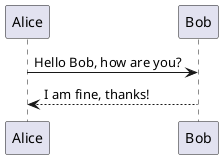

# Installing and Setting Up PlantUML in VS Code

UML diagrams from simple textual descriptions. Here's how you can install and configure PlantUML in Visual Studio Code (VS Code) to enhance your documentation and development workflows.

## Prerequisites

Before you start, make sure you have the following installed:
- **Java**: PlantUML requires Java to run. You can download it from [Oracle's website](https://www.oracle.com/java/technologies/javase-jdk11-downloads.html) or use OpenJDK.
- **Visual Studio Code**: If not already installed, download and install from [here](https://code.visualstudio.com/).

## Installation Steps

### Step 1: Install the PlantUML Extension in VS Code

1. Open VS Code.
2. Go to the Extensions view by clicking on the square icon on the sidebar or pressing `Ctrl+Shift+X`.
3. Search for `PlantUML` by `jebbs`.
4. Click on the install button next to the extension.

### Step 2: Install Graphviz (Optional)

Graphviz is optional but recommended for additional diagram functionalities:

- **Windows**:
  - Download the installer from [Graphviz's Download Page](https://graphviz.org/download/).
  - Install Graphviz and add its `bin` directory to your system's PATH.
  
- **macOS**:
  - Use Homebrew: Run `brew install graphviz` in the terminal.
  
- **Linux**:
  - Use your package manager, e.g., for Ubuntu run `sudo apt-get install graphviz`.

### Step 3: Configure the PlantUML Extension

After installing the PlantUML extension and Graphviz, configure your settings:

1. Open VS Code settings by going to `File > Preferences > Settings` or pressing `Ctrl+,`.
2. In the search bar at the top, type `PlantUML`.
3. Set the path to your Graphviz executable:
   - For Windows, it might be something like `C:\\Program Files\\Graphviz\\bin\\dot.exe`.
   - For macOS/Linux, it is typically `/usr/bin/dot` or `/usr/local/bin/dot`.
4. Ensure Java is correctly set up by confirming the Java path in the PlantUML configuration if it does not automatically detect.

### Step 4: Create and Render Diagrams

To create a UML diagram:
1. Create a new file with a `.puml` extension or open an existing one.
2. Write your PlantUML code.
3. To preview the diagram, use the `Alt-D` shortcut or open the command palette (`Ctrl+Shift+P`) and type `PlantUML: Preview Current Diagram`.

## Example Diagram

Here's a simple example to get you started with PlantUML in VS Code:

